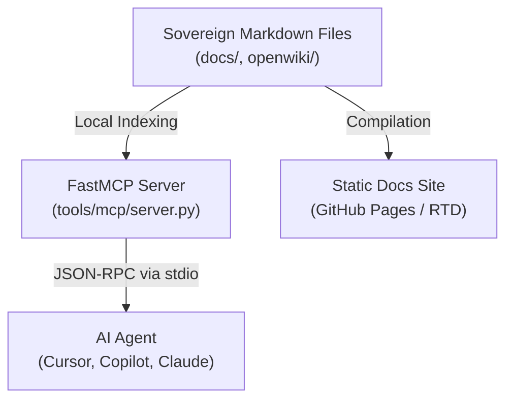

# OpenWiki and FastMCP architecture

An in-depth explanation of the technical design, data flows, and reasoning behind OpenWiki and FastMCP integrations.

## High-level architecture

The DSOM knowledge layer bridges localised documents to active AI agents via two complementary components:

## Why pure Python OpenWiki?

Historically, OpenWiki implementations required heavy Node.js runtimes or cloud compiler keys. This design violated **Sovereign AI Rule 27 (Zero-Binary Mandate)**.

Replacing Node binaries with the pure Python `openwiki_emulator.py` provides:
- **Zero Node.js dependencies:** The script runs offline using standard Python library APIs and the `pyyaml` package.
- **In-place self-healing:** The emulator scans embedded diagrams, detects syntactical errors, degrades blocks gracefully, and heals them when fixed.

## FastMCP context routing

The FastMCP server (`tools/mcp/server.py`) acts as the primary API broker for AI engines.

Rather than feeding the entire documentation codebase into the context window, the server enables **Progressive Disclosure**:
1. The AI reads condensed states (`dsom://brain/state`).
2. If further details are needed, the AI calls targeted tools (`search_palace` or `search_openwiki`).
3. Only the relevant context fragments are returned, reducing overall token usage.

---
*Deep State of Mind (DSOM) For My AI Protocol | Harisfazillah Jamel (LinuxMalaysia) | 2026-08-14*
*Standard: UK English | DBP-standard Bahasa Melayu Malaysia (Piawai) | GNU General Public License v3.0*
