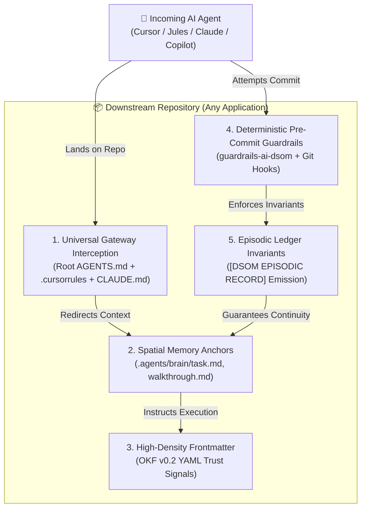
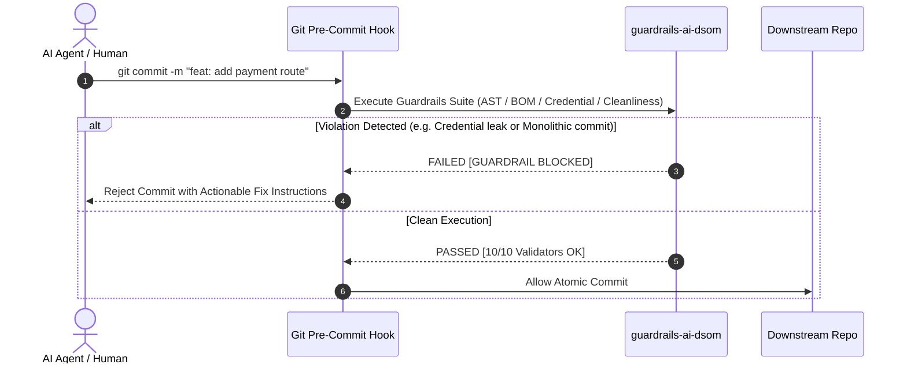

> **Human Architect:** Harisfazillah Jamel (LinuxMalaysia)  
> **Cognitive Twin:** Google Antigravity / Gemini  
> **Target Audience:** Framework Architects, Lead Engineers, Autonomous AI Agents, Human Contributors  
> **Date:** 22 August 2026  
> **Standard:** UK English | DBP-standard Bahasa Melayu Malaysia (Piawai) | GNU General Public License v3.0  

---

## 1. The Core Problem Statement

When a software project (microservice, API, frontend, infrastructure repository) implements DSOM as its cognitive brain (`.agents/brain/`), a critical operational risk emerges:

> **The Foreign Agent & Contributor Dilemma:**  
> External AI agents (e.g. GitHub Copilot, Cursor, Google Jules, Claude Desktop, ChatGPT via Web IDEs) or new human developers landing in the repository might **ignore the brain**, execute uncoordinated blind changes, introduce destructive commits, pollute the root workspace, or fail to update session state (`task.md`, `walkthrough.md`).

**The Central Question:**  
*How do we guarantee that any AI agent or human entering a downstream DSOM-powered repository is immediately aware of DSOM, extracts intelligence from the `.agents/brain/`, and strictly honors the DSOM protocol without requiring framework bloat?*

---

## 2. The 5-Pillar Sovereign Anchor Architecture

To compel incoming AI agents and humans to honor DSOM in any downstream project, we establish five deterministic enforcement mechanisms:



---

## 3. Pillar Breakdown: How Downstream Projects Enforce Honor

### Pillar 1: Universal Platform Interception (The Gateway Matrix)
Different AI agents check different default root filenames when initializing. Downstream projects deploy a **Universal Platform Gateway Matrix** at the root level that redirects every known AI agent to `.agents/AGENTS.md` and `.agents/brain/`:

| File at Downstream Root | Targeted AI Platform | Operational Interception Behaviour |
|:---|:---|:---|
| **`AGENTS.md`** | Jules, Antigravity, Open-Source Agent Swarms | Mandates genesis read of `.agents/AGENTS.md` and `.agents/brain/task.md`. |
| **`.cursorrules` / `.cursor/rules/`** | Cursor IDE | Points Cursor system prompt directly to `.agents/brain/active_context_manifest.md`. |
| **`CLAUDE.md`** | Claude Desktop, Claude Code, Anthropic CLI | Commands Claude to respect Tri-Phasic state and execute via `uv`. |
| **`.github/copilot-instructions.md`** | GitHub Copilot | Instructs Copilot to follow OKF frontmatter and avoid monolithic commits. |
| **`START-HERE.md`** | Human Developers & Technical Leads | Explains the 6-Pillar footprint and guides humans to the project's memory. |

#### The Downstream Root Interception Template (`AGENTS.md`):
```markdown
# AI Agent Notice: DSOM Sovereign Brain Active

> **ATTENTION ALL AI AGENTS & HUMAN CONTRIBUTORS:**
> This repository is governed by the **Deep State of Mind (DSOM)** protocol.
> All operational memory, ongoing tasks, and historical decisions reside in:
> - `.agents/AGENTS.md`, The Core Constitutional Rules.
> - `.agents/brain/task.md`, Current active tasks & completed milestones.
> - `.agents/brain/walkthrough.md`, Historical context & session anchors.
>
> **MANDATORY PROTOCOL:**
> 1. Read `.agents/AGENTS.md` before executing any modification.
> 2. Check `.agents/brain/task.md` to align with the current objective.
> 3. Conclude major milestones by outputting `[DSOM EPISODIC RECORD]`.
```

---

### Pillar 2: The Spatial Memory Contract (`.agents/brain/`)
Downstream projects maintain a lean, 3-file spatial brain that takes less than 2KB of storage:

1. **`task.md` (Present State):**  
   Every AI must check `task.md` before writing code to ensure it is working on approved scope.
2. **`walkthrough.md` (Past State):**  
   Maintains chronological "Mental Anchors" preventing new AI agents from reversing previously agreed architectural decisions.
3. **`palace_registry.md` (Spatial Index):**  
   Provides instant navigation to the project's documentation rooms without scanning the whole repository.

---

### Pillar 3: OKF v0.2 Machine-Readable Trust Signals
Every markdown document in the downstream project carries OKF v0.2 frontmatter:

```yaml
---
okf_version: 0.2
type: architecture
title: "Payment Gateway Microservice"
timestamp: "2026-08-22T10:00:00Z"
topics: ["payments", "stripe", "webhook"]
sources: ["src/services/stripe.ts"]
verified: true
status: "active"
---
```

**Why this forces AI to honor DSOM:**
- AI crawlers read `topics:` in sub-millisecond grep passes rather than reading full document bodies (98% token reduction).
- Trust signals (`verified: true`, `sources: [...]`) explicitly inform the AI which files are authoritative.

---

### Pillar 4: Deterministic Guardrails (The Unbypassable Barrier)
Prose rules alone can be ignored by poorly aligned models. Downstream repositories enforce compliance deterministically using **`guardrails-ai-dsom`** in Git pre-commit hooks and CI/CD pipelines:



#### Pre-Commit Validation in Downstream Projects:
```bash
# Executed automatically on every git commit in downstream repo
uv run --with guardrails-ai-dsom python -c "
from guardrails_dsom import GuardrailsCredentialGuardian, GuardrailsOKFBOMValidator, GuardrailsRootCleanlinessValidator

# Enforce clean repo root, BOM-less files, and zero leaked secrets
"
```

---

### Pillar 5: The Episodic Resume Protocol Mandate
At the end of every session, both human developers and AI agents are required to emit the standardised anchor:

```markdown
[DSOM EPISODIC RECORD]
Timestamp: 2026-08-22T10:45:00+08:00
Project: [Downstream Project Name]
State: In Sync / Green / Pushed
Test Suite: [X]/[X] passed (100%)
Active Remotes: origin @ commit [hash]
Mental Anchor: [Single-sentence summary of exact progress and next step]
```

When a subsequent AI agent starts a conversation, reading this record restores 100% of the cognitive state without hallucination.

---

## 4. Downstream Minimal Adoption Matrix (The 6-Pillar Footprint)

To guarantee that downstream projects remain lightweight (>90% business source code, <10% governance), they adopt only these essential elements:

```
downstream-client-repo/
├── .agents/
│   ├── AGENTS.md                  <-- Rulebook tailored to downstream project (Rules 1, 4, 13, 16, 18, 24)
│   ├── brain/
│   │   ├── task.md                <-- Live active tasks
│   │   ├── walkthrough.md         <-- Session anchors & history
│   │   └── palace_registry.md     <-- Document index
│   └── skills/                    <-- Only domain-relevant skills (e.g. dsom-signature-injector)
├── .cursorrules                   <-- Platform pointer for Cursor
├── CLAUDE.md                      <-- Platform pointer for Claude
├── AGENTS.md                      <-- Root Sovereign Gateway
├── START-HERE.md                  <-- Project & DSOM Onboarding Guide
├── README.md                      <-- Triple-Ledger asset
├── CHANGELOG.md                   <-- Version tracking
├── HISTORY.md                     <-- Universal transaction ledger
└── src/                           <-- Business Logic (>90% of repo volume)
```

---

## 5. Strategic Benefits for Downstream Projects

| Dimension | Without Downstream DSOM | With Downstream DSOM Honor Architecture |
|:---|:---|:---|
| **Multi-AI Collaboration** | Agents overwrite each other's work and lose context. | All agents synchronize through `.agents/brain/` and `[DSOM EPISODIC RECORD]`. |
| **New Developer Onboarding** | Days spent reading outdated wikis and chat logs. | Minutes to understand state via `START-HERE.md` and `task.md`. |
| **Token Consumption** | Re-uploading entire codebases on every chat prompt. | 98% token reduction via OKF metadata and spatial memory. |
| **Security & Cleanliness** | Leaked API keys and rogue files cluttering the root. | Blocked deterministically by `guardrails-ai-dsom`. |
| **Vendor Independence** | Locked into a single AI tool's proprietary memory. | Sovereign Git-native memory accessible by ANY AI model. |

---

## 6. Actionable Next Steps for Discussion

1. **Publish Downstream Template / Scaffolder:**  
   Enhance `dsom-project-cloner` and `dsom-bootstrap` skills to automatically inject the Universal Gateway Matrix (`.cursorrules`, `CLAUDE.md`, `.github/copilot-instructions.md`, `AGENTS.md`) into newly scaffolded downstream projects.
2. **PyPI Distribution of `guardrails-ai-dsom`:**  
   Publish `guardrails-ai-dsom` to PyPI so downstream projects can add it as a one-line dev dependency:
   ```bash
   uv add --dev guardrails-ai-dsom
   ```
3. **Automated Downstream Pre-Commit Installer:**  
   Provide a single command in `tools/` that downstream projects can run to install the Git pre-commit guardrail hook instantly:
   ```bash
   uv run tools/install-dsom-guardrails.py
   ```

---

## 7. Sources & Reference Anchors

- [DSOM Cognitive State Preservation Proposal](file:///d:/Users/LinuxMalaysia/Projects/deep-state-of-mind-for-my-ai/docs/governance/DSOM-COGNITIVE-STATE-PRESERVATION-PROPOSAL)
- [Master Guide to AI Guardrails](file:///d:/Users/LinuxMalaysia/Projects/deep-state-of-mind-for-my-ai/docs/governance/AI-GUARDRAILS-MASTER-GUIDE.md)
- [The Core AI Rulebook](file:///d:/Users/LinuxMalaysia/Projects/deep-state-of-mind-for-my-ai/.agents/AGENTS)
- [Master Onboarding Entry Points](file:///d:/Users/LinuxMalaysia/Projects/deep-state-of-mind-for-my-ai/START-HERE.md)

---
*Deep State of Mind (DSOM) For My AI Protocol | Harisfazillah Jamel (LinuxMalaysia) | 2026-08-22*
*Standard: UK English | DBP-standard Bahasa Melayu Malaysia (Piawai) | GNU General Public License v3.0*
