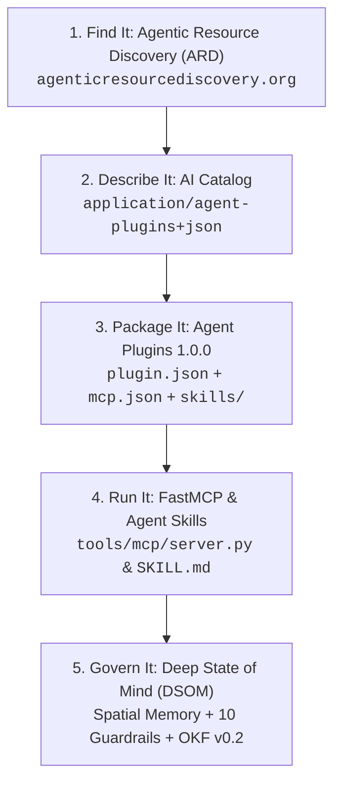

# 📦 Agent Plugins 1.0.0 Specification & DSOM Integration

> **Entry Point 20:** This document defines the packaging, distribution, and runtime interoperability architecture for **Agent Plugins 1.0.0** within the Deep State of Mind (DSOM) framework.

---

## 🎯 Executive Summary & Context

**Agent Plugins 1.0.0** is an open, vendor-neutral directory specification governed by core maintainers from **Google (DeepMind / Cloud), Amazon, Microsoft, OpenAI, Cursor, and Vercel**. It eliminates packaging friction across disparate AI coding agents and IDEs by standardising how **Agent Skills** and **Model Context Protocol (MCP) servers** are bundled, discovered, and executed in a single portable directory.

Under the DSOM protocol, **Agent Plugins 1.0.0** serves as the universal distribution and packaging standard, seamlessly bridging DSOM's Sovereign Brain (`.agents/brain/`), Skills repository (`.agents/skills/`), and FastMCP Server (`tools/mcp/server.py`) across Google Antigravity, Google Jules, Claude Code, Cursor, and enterprise agent environments.

---

## 🏛️ The 5-Layer Agent Ecosystem Architecture



1. **Find it — Agentic Resource Discovery (ARD):** Discovers available plugins and capabilities prior to invocation.
2. **Describe it — AI Catalog:** Indexes plugin descriptors and resource mappings.
3. **Package it — Agent Plugins 1.0.0:** Standardised directory layout, manifest (`plugin.json`), and MCP descriptor (`mcp.json`).
4. **Run it — MCP & Agent Skills:** Portable execution contracts across transports (`stdio`, `streamable-http`, `sse`).
5. **Govern it — DSOM Metacognition:** Tri-Phasic Mind cognitive continuity, 10 Custom Guardrails, and GitOps audit trail.

---

## 📐 Package Layout Standard (Rule 30)

Every DSOM-compliant Agent Plugin adheres to the fixed filesystem layout:

```text
my-dsom-plugin/
├── plugin.json              # Required: Closed manifest (schema 1.0.0)
├── mcp.json                 # Optional: Explicit MCP server descriptors
├── skills/                  # Optional: Fixed directory for Agent Skills
│   └── summarize/
│       ├── SKILL.md         # Open Knowledge Format (OKF v0.2)
│       ├── scripts/         # Idempotent execution scripts
│       └── references/      # Progressive disclosure documentation
├── org.dsom.protocol/       # Optional: Client extension namespace
│   ├── guardrails.json      # DSOM custom validators configuration
│   └── hooks/               # Tri-Phasic interception hooks
├── LICENSE                  # GNU GPL v3.0 / SPDX identifier
└── CHANGELOG.md             # Semantic version ledger
```

---

## 📜 Manifest Contracts

### 1. `plugin.json` (Root Manifest)
The root manifest declares metadata and targeted schema version:

```json
{
  "$schema": "https://agent-plugins.org/schemas/1.0.0/plugin.schema.json",
  "name": "deep-state-of-mind",
  "version": "10.4.0",
  "description": "Deep State of Mind (DSOM) Sovereign AI Agent Cognitive Architecture, Open Knowledge Format (OKF), and Model Context Protocol (MCP) toolset.",
  "author": {
    "name": "Harisfazillah Jamel (LinuxMalaysia)",
    "email": "linuxmalaysia@gmail.com",
    "url": "https://github.com/linuxmalaysia"
  },
  "homepage": "https://linuxmalaysia.github.io/deep-state-of-mind-for-my-ai/",
  "repository": "https://github.com/linuxmalaysia/deep-state-of-mind-for-my-ai",
  "license": "GPL-3.0-or-later",
  "keywords": [
    "dsom",
    "ai-agents",
    "mcp",
    "agent-skills",
    "agent-plugins"
  ],
  "extensions": {
    "org.dsom.protocol": {
      "tri_phasic_mind": true,
      "okf_version": "0.2"
    }
  }
}
```

### 2. `mcp.json` (MCP Configuration)
Maps Model Context Protocol servers explicitly without guesswork:

```json
{
  "$schema": "https://agent-plugins.org/schemas/1.0.0/mcp.schema.json",
  "mcpServers": {
    "dsom-knowledge-server": {
      "type": "stdio",
      "command": "uv",
      "args": [
        "run",
        "--with",
        "fastmcp",
        "--with",
        "pyyaml",
        "python",
        "${PLUGIN_ROOT}/tools/mcp/server.py"
      ],
      "env": {
        "DSOM_PALACE_ROOT": "${PLUGIN_ROOT}",
        "DSOM_STORAGE_DIR": "${PLUGIN_DATA}/storage"
      },
      "cwd": "${PLUGIN_ROOT}"
    }
  }
}
```

---

## 🛡️ Variable Expansion & Path Containment

The specification defines two strict environment variables that conformant clients MUST provide to plugin subprocesses:

1. **`${PLUGIN_ROOT}`**: Absolute path to the resolved plugin root. Used for referencing bundled binaries, Python scripts (`tools/mcp/server.py`), and documentation palaces.
2. **`${PLUGIN_DATA}`**: Client-managed persistent directory dedicated to that installed plugin instance. Used for virtual environments, local SQLite caches, and generated artifacts.

> [!CAUTION]
> **Path Containment Invariant (§4.1):** All relative paths defined in `mcp.json` or plugin configurations MUST resolve strictly within `${PLUGIN_ROOT}` or `${PLUGIN_DATA}`. Any attempt to traverse upward (`../`) outside the root boundary will cause compliant clients to reject the component.

---

## 🛠️ Step-by-Step: Packaging a DSOM Skill as an Agent Plugin

1. **Create the Plugin Directory**:
   ```bash
   mkdir -p plugins/my-ops-plugin/skills/sys-audit
   ```
2. **Write `plugin.json`**:
   ```json
   {
     "$schema": "https://agent-plugins.org/schemas/1.0.0/plugin.schema.json",
     "name": "my-ops-plugin"
   }
   ```
3. **Add OKF v0.2 `SKILL.md`**:
   Place your standard DSOM skill inside `skills/sys-audit/SKILL.md`.
4. **Attach MCP Server (Optional)**:
   Add `mcp.json` declaring any auxiliary stdio or streamable HTTP tools.
5. **Verify with DSOM Guardrails**:
   ```bash
   uv run python tools/install_git_guardrails.py
   uv run pytest tests/test_agent_plugins_spec.py
   ```

---

## 📚 Related Governance & References

- [`docs/governance/DSOM-MCP-ARCHITECTURE.md`](file:///d:/Users/LinuxMalaysia/Projects/deep-state-of-mind-for-my-ai/docs/governance/DSOM-MCP-ARCHITECTURE.md) — FastMCP Server Reference.
- [`docs/governance/AI-GUARDRAILS-MASTER-GUIDE.md`](file:///d:/Users/LinuxMalaysia/Projects/deep-state-of-mind-for-my-ai/docs/governance/AI-GUARDRAILS-MASTER-GUIDE.md) — Pre-Commit & Runtime Interception.
- [Agent Plugins 1.0.0 Specification](https://agent-plugins.org/specification) — Normative Standard.

---
*Deep State of Mind (DSOM) For My AI Protocol | Harisfazillah Jamel (LinuxMalaysia) | 2026-08-22*  
*Standard: UK English | DBP-standard Bahasa Melayu Malaysia (Piawai) | GNU General Public License v3.0*
