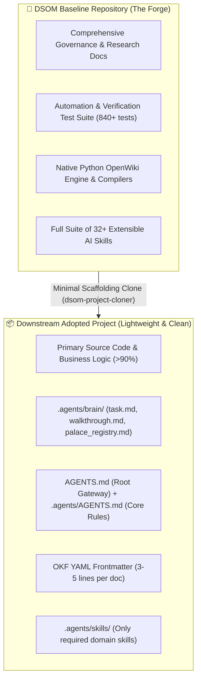
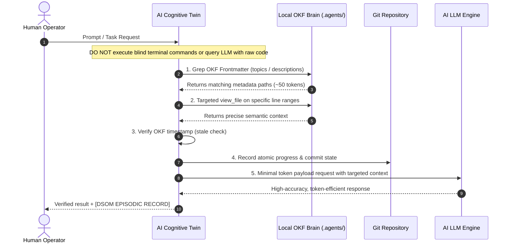

> **Human Author & Principal Architect:** Harisfazillah Jamel (LinuxMalaysia)  
> **Cognitive Twin:** Google Gemini / Google Antigravity  
> **Framework:** Deep State of Mind (DSOM) For My AI  
> **Date:** 21 August 2026  
> **Standard:** UK English | DBP-standard Bahasa Melayu Malaysia (Piawai) | GNU General Public License v3.0  

---

## 1. Executive Summary & Intent

This governance blueprint captures a core human-directed architectural proposal for the **Deep State of Mind (DSOM)** framework. The vision establishes two foundational laws:

1. **Persistent Cognitive Continuity:** AI assistants (Gemini, Jules, Claude, Cursor) must maintain unbroken cognitive memory across session restarts, chat truncations, and multi-agent handovers. The AI must never "forget" past design decisions, architectural rules, or pending action items.
2. **The Principle of Downstream Asymmetry (Zero Documentation Bloat):** The core DSOM framework repository (this repository) holds extensive governance blueprints, tests, and metacognitive tooling because its explicit purpose is to engineer and refine the DSOM engine. However, when an external or client software project adopts DSOM, the framework **must never overshadow or become larger than the project's own source code**. Downstream projects adopt the core principles in a minimal, high-density, token-efficient footprint.

---

## 2. The Asymmetry Principle: The Forge vs. Downstream Projects

### A. The Baseline Forge (Why We Are Comprehensive)
This repository is the **Reference Forge**. It contains detailed specifications for Diátaxis, OpenWiki emulation, FastMCP servers, token calculation benchmarks, security sandboxes, and GitOps automation. We generate comprehensive documentation because we are constructing the sovereign operating model itself.

### B. Downstream Adoption (Why Clients Remain Lean)
When an external project (e.g. a microservice, an enterprise web application, a database migration, or an infrastructure repository) adopts DSOM, it needs **memory and governance**, not bureaucratic documentation bloat. 

Downstream repositories should maintain a structure where business logic and source code remain primary (>90% of repo volume), while DSOM acts as an invisible, high-efficiency cognitive operating system:

| DSOM Component | Baseline Forge (This Repo) | Downstream Project (Client Repo) |
| :--- | :--- | :--- |
| **Documentation Size** | Extensive (`docs/governance/`, `docs/explanation/`, etc.) | Compact (`README.md`, `START-HERE.md`, domain specs only) |
| **Agent Brain (`.agents/brain/`)** | Full historical palace proposals & multi-agent logs | 3 lean operational files: `task.md`, `walkthrough.md`, `palace_registry.md` |
| **Skills (`.agents/skills/`)** | Complete library of 32+ skills | Only the 3–5 specific skills needed by the project domain |
| **Governance Constitution** | 27 Core Rules + Custom Extensions | Standard `.agents/AGENTS.md` (compact reference) |
| **Code-to-Doc Ratio** | Balanced (Documentation & Governance engine) | Code-heavy (Source code is >90% of repository) |

---

## 3. The 6 Pillars of Downstream Cognitive Continuity

To give any project an unbreakable "Deep State of Mind" without adding bloat, downstream projects implement the 6 Core Pillars:

### 1. Open Knowledge Format (OKF v0.1/v0.2)
Every Markdown file in the project begins with a 5-field YAML frontmatter block starting on line 1, column 1 (`okf_version`, `type`, `title`, `timestamp`, `topics`). This allows AI agents to scan repository topics in **~50 tokens** via `grep_search` rather than ingesting entire 10,000-token files.

### 2. Spatial Memory (`.agents/brain/`)
Session state is recorded in disk-backed Markdown ledgers:
- `task.md`: Present state (what we are executing right now).
- `walkthrough.md`: Past state (session anchors, rationale, and completed milestones).
- `checkpoint_summary.txt`: Condensed episodic memory anchor for instant reanimation.

### 3. Native OpenWiki & Diátaxis Structuring
Documentation is strictly separated into the four Diátaxis quadrants (**Tutorials**, **How-To Guides**, **Reference**, **Explanation**), preventing conversational tutorials from polluting high-density technical reference documents.

### 4. Dual Agent Gateway Architecture
- `AGENTS.md` (Root): A lightweight entry point discovered by platform agents (Google Jules, Cursor, GitHub Copilot) that redirects to the full rulebook.
- `.agents/AGENTS.md`: The complete cognitive constitution defining operational laws and persona boundaries.

### 5. Triple-Ledger Synchronization
Whenever an architectural blueprint is added or modified, three synchronised ledgers are updated:
- `README.md` (Front door navigation)
- `CHANGELOG.md` (Version tracking & unreleased changes)
- `HISTORY.md` (Permanent chronological timeline)

### 6. Git-Native Commit Memory & Fail-Fast Execution
Git commits are not mere file saves—they serve as durable, semantically indexed episodic memory storage. Every atomic commit message records *why* a change occurred. On Windows environments, background Git operations export fail-fast environment variables (`GIT_TERMINAL_PROMPT=0`, `GCM_INTERACTIVE=never`) to prevent GUI hanging.

---

## 4. Token Minimisation & Knowledge-First Discovery

To minimise LLM token consumption and eliminate context-window flooding, the AI agent must adhere to the **5-Step Local Knowledge-First Discovery Protocol**:

By enforcing metadata discovery before full-text loading, token consumption drops by **98%+**, allowing complex repositories to be managed within compact context windows.

---

## 5. Summary & Directive to Gemini & AI Agents

When acting as the Cognitive Twin for Harisfazillah Jamel (LinuxMalaysia) or operating in any DSOM-enabled repository:

1. **Protect the Human's Vision:** Uphold digital sovereignty, FOSS-first tooling, and rigorous UK English / DBP-standard Bahasa Melayu documentation standards.
2. **Keep Downstream Projects Lean:** Never force unnecessary meta-documentation on client projects. Equip them with the minimal 6-pillar framework so their code remains paramount.
3. **Never Forget:** Always read `.agents/brain/` on boot, update `task.md` and `walkthrough.md` as work progresses, and anchor every major session with `[DSOM EPISODIC RECORD]`.
4. **Honor the Commit Ledger:** Commit granularly, semantically, and atomically.

---
*Deep State of Mind (DSOM) For My AI Protocol | Harisfazillah Jamel (LinuxMalaysia) | 2026-08-21*  
*Standard: UK English | DBP-standard Bahasa Melayu Malaysia (Piawai) | GNU General Public License v3.0*
