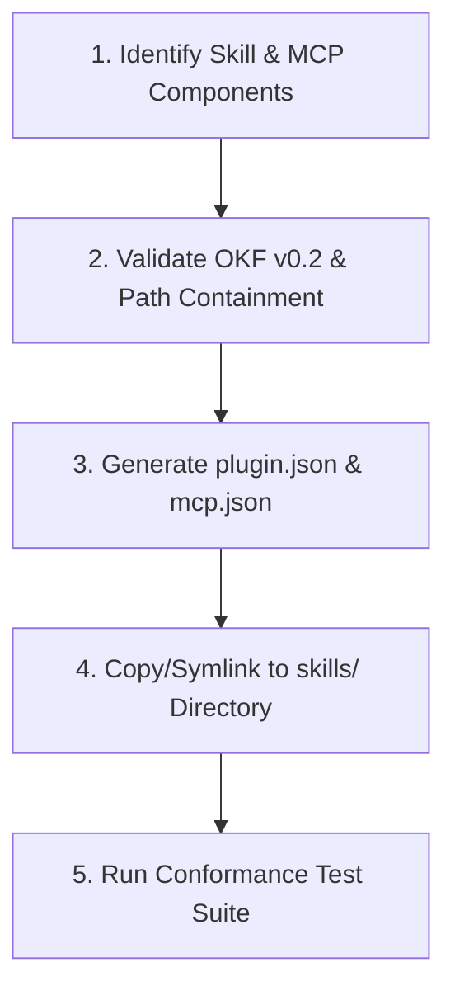

> **SOP Type:** Automated Packaging & Verification  
> **Standard:** Agent Plugins 1.0.0 Specification (`agent-plugins.org/specification`)

This skill defines the procedural Standard Operating Procedure (SOP) for packaging DSOM skills, spatial memory, and MCP servers into vendor-neutral **Agent Plugins 1.0.0** packages.

---

## 🧭 Operational Flow



---

## 🛠️ Step-by-Step Instructions

### Step 1: Scaffold the Plugin Package Directory
```powershell
# PowerShell
$PluginName = "dsom-sysops-plugin"
mkdir $PluginName
mkdir $PluginName/skills
```
```bash
# Bash
export PLUGIN_NAME="dsom-sysops-plugin"
mkdir -p "$PLUGIN_NAME/skills"
```

### Step 2: Create Canonical `plugin.json`
Create `$PLUGIN_NAME/plugin.json` adhering to schema 1.0.0:
```json
{
  "$schema": "https://agent-plugins.org/schemas/1.0.0/plugin.schema.json",
  "name": "dsom-sysops-plugin",
  "version": "1.0.0",
  "description": "System operations and diagnostic skills for AI Agents.",
  "keywords": ["sysops", "diagnostics", "dsom"]
}
```

### Step 3: Populate `skills/` Directory
Copy target skills into `$PLUGIN_NAME/skills/<skill-name>/`:
Ensure each skill folder contains:
- `SKILL.md` (valid OKF v0.2 frontmatter)
- `scripts/` (executable scripts)
- `references/` (supporting docs)

### Step 4: Configure `mcp.json` (If Tools are Included)
```json
{
  "$schema": "https://agent-plugins.org/schemas/1.0.0/mcp.schema.json",
  "mcpServers": {
    "server": {
      "type": "stdio",
      "command": "uv",
      "args": ["run", "python", "${PLUGIN_ROOT}/tools/mcp/server.py"],
      "cwd": "${PLUGIN_ROOT}"
    }
  }
}
```

### Step 5: Validate Conformance
Run the DSOM agent plugins test suite:
```bash
uv run pytest tests/test_agent_plugins_spec.py
```

---
*Deep State of Mind (DSOM) For My AI Protocol | Harisfazillah Jamel (LinuxMalaysia) | 2026-08-22*  
*Standard: UK English | DBP-standard Bahasa Melayu Malaysia (Piawai) | GNU General Public License v3.0*
