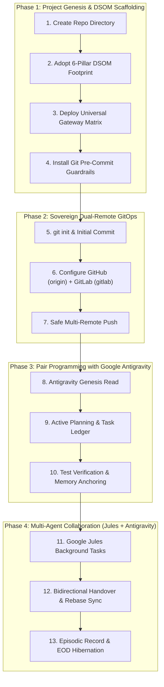
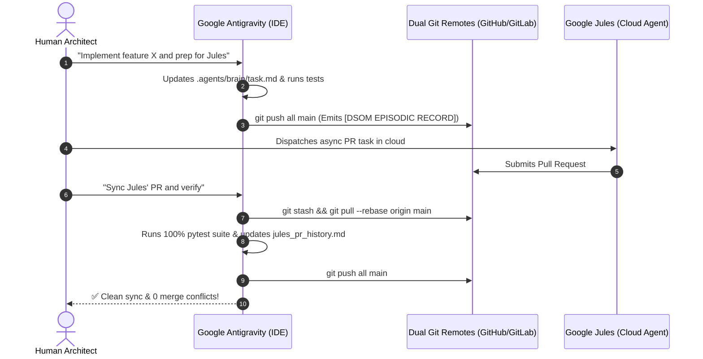

> **Audience:** Engineering Teams, Technical Leads, DevOps Engineers, and AI System Architects.  
> **Prerequisites:** Git installed, PowerShell 7+ or Bash (Linux/macOS/WSL2), Python 3.11+ with `uv`.

Welcome to the **Deep State of Mind (DSOM)** Team Masterclass. This guide will walk you step-by-step through the exact lifecycle used by senior ICT consultants: from bootstrapping a brand-new repository, to pair programming with **Google Antigravity**, pushing to dual remotes (**GitHub + GitLab**), and collaborating asynchronously with autonomous agents like **Google Jules**.

---

## 🧭 The 4-Phase Team Operational Lifecycle



---

## 🚀 Step 0: Agent Onboarding Prompt (Genesis Synchronization)

Before issuing code instructions or starting a new agent session (Antigravity, Jules, Cursor, Claude), synchronize the AI agent with the DSOM framework directly from its authoritative online entry point:

### 📋 Copy & Paste This Initialisation Prompt:

```markdown
I need you to adopt Deep State Of Mind (DSOM) For My AI by reading this in detail, and make sure you also read all others supporting documents and pages and do your own deep research and make sure all into AI Agents Knowledge and .agents/brain

https://linuxmalaysia.github.io/deep-state-of-mind-for-my-ai/START-HERE/
Welcome to the Deep State of Mind (DSOM) For My AI framework. If you are adopting this repository to bootstrap a new infrastructure/software project, or onboarding a new human team member or AI agent, you must understand how to enter the system.
DSOM is a modular Sovereign AI Engine. To use it effectively, do not read every file at random. Start with the defined Entry Points depending on your role.
```

---

## 🛠️ Phase 1: Project Genesis & DSOM Adoption (The 6-Pillar Setup)

When starting a project (whether a Python backend, Node.js API, or Go microservice), you adopt DSOM as the project's **Cognitive Digital Twin**.

### Step 1.1: Create the Project Directory
```powershell
# Windows PowerShell
mkdir D:\Projects\my-awesome-service
cd D:\Projects\my-awesome-service
```
```bash
# Linux / macOS / WSL2
mkdir -p ~/projects/my-awesome-service
cd ~/projects/my-awesome-service
```

### Step 1.2: Adopt the Minimal 6-Pillar Footprint (Downstream Asymmetry)
In downstream projects, **your business code remains primary (>90% of repo volume)**. You only need the lean 6-Pillar DSOM engine from the baseline repository:

1. **Spatial Memory (`.agents/brain/`)**:
   - `task.md`, Present task checklist.
   - `walkthrough.md`, Session history & Mental Anchors.
   - `palace_registry.md`, Documentation room index.
2. **Constitutional Engine (`.agents/AGENTS.md`)**:
   - Contains the 29 Constitutional AI Laws and Linguistic Persona.
3. **Universal Gateway Matrix (Root)**:
   - `AGENTS.md` (Root gateway for agents)
   - `.cursorrules` (Cursor IDE integration)
   - `CLAUDE.md` (Claude Desktop / Anthropic CLI)
   - `.github/copilot-instructions.md` (GitHub Copilot)
   - `START-HERE.md` (Human & AI onboarding roadmap)
4. **Pre-Commit Guardrails (`tools/`)**:
   - `tools/install_git_guardrails.py` & `tools/guardrails-ai-dsom/`
5. **Triple-Ledger**:
   - `README.md`, `CHANGELOG.md`, `HISTORY.md`
6. **Isolated Python Tooling**:
   - Powered by `uv`.

---

#### Method A: Prompting Google Antigravity (Automated AI Scaffolding)
If you have Antigravity open in the baseline DSOM workspace or in your new workspace, copy and paste this exact prompt:

```markdown
Use the `dsom-project-cloner` skill to scaffold a brand-new DSOM downstream project for me.

Target Repository Path: D:\Projects\my-awesome-service

Please:
1. Create the required directory structure (.agents/brain, .agents/skills, docs/governance, tools/).
2. Copy the Universal Gateway Matrix (.cursorrules, CLAUDE.md, .github/copilot-instructions.md, AGENTS.md, plugin.json, mcp.json).
3. Copy the Constitutional Rulebook (.agents/AGENTS.md) and reset .agents/brain/ with blank OKF templates.
4. Copy the tools/ directory and automatically execute `python tools/install_git_guardrails.py` in the new target path.
5. Ensure all copied markdown files carry valid OKF v0.2 frontmatter and standard DSOM signatures.
```

---

#### Method B: Manual Copy via Terminal (PowerShell / Windows)
If copying manually from a local clone of `deep-state-of-mind-for-my-ai` on Windows:

```powershell
# Set variables
$DSOM_BASE = "D:\Users\LinuxMalaysia\Projects\deep-state-of-mind-for-my-ai"
$TARGET = "D:\Projects\my-awesome-service"

# 1. Create Target Directory Tree
New-Item -ItemType Directory -Force -Path "$TARGET\.agents\brain"
New-Item -ItemType Directory -Force -Path "$TARGET\.agents\skills"
New-Item -ItemType Directory -Force -Path "$TARGET\.github"
New-Item -ItemType Directory -Force -Path "$TARGET\docs\governance"
New-Item -ItemType Directory -Force -Path "$TARGET\tools"

# 2. Copy the Universal Gateway Matrix & Manifests
Copy-Item "$DSOM_BASE\AGENTS.md" "$TARGET\"
Copy-Item "$DSOM_BASE\.cursorrules" "$TARGET\"
Copy-Item "$DSOM_BASE\CLAUDE.md" "$TARGET\"
Copy-Item "$DSOM_BASE\START-HERE.md" "$TARGET\"
Copy-Item "$DSOM_BASE\plugin.json" "$TARGET\"
Copy-Item "$DSOM_BASE\mcp.json" "$TARGET\"
Copy-Item "$DSOM_BASE\.github\copilot-instructions.md" "$TARGET\.github\"

# 3. Copy the Core Rulebook and Tooling
Copy-Item "$DSOM_BASE\.agents\AGENTS.md" "$TARGET\.agents\"
Copy-Item -Recurse "$DSOM_BASE\tools\*" "$TARGET\tools\"

# 4. Copy Essential Domain Skills (e.g., token calculator, signature injector, plugin packager)
Copy-Item -Recurse "$DSOM_BASE\.agents\skills\dsom-token-calculator" "$TARGET\.agents\skills\"
Copy-Item -Recurse "$DSOM_BASE\.agents\skills\dsom-signature-injector" "$TARGET\.agents\skills\"
Copy-Item -Recurse "$DSOM_BASE\.agents\skills\agent-plugin-packager" "$TARGET\.agents\skills\"
Copy-Item -Recurse "$DSOM_BASE\.agents\skills\initialize-gitops" "$TARGET\.agents\skills\"

# 5. Initialize Fresh Brain in the Target
Set-Location $TARGET
bash tools/init-brain.sh  # Or .\tools\init-brain.ps1
```

---

#### Method C: Manual Copy via Terminal (Bash / Linux / macOS / WSL2)
If copying on Linux/macOS or via a temporary `git clone`:

```bash
# Clone DSOM baseline into a temp location (if not already local)
git clone https://github.com/linuxmalaysia/deep-state-of-mind-for-my-ai.git /tmp/dsom-baseline

# Set variables
DSOM_BASE="/tmp/dsom-baseline"
TARGET="$HOME/projects/my-awesome-service"

# 1. Create directory tree
mkdir -p "$TARGET/.agents/brain" "$TARGET/.agents/skills" "$TARGET/.github" "$TARGET/docs/governance" "$TARGET/tools"

# 2. Copy Universal Gateway Matrix, Manifests & Constitution
cp "$DSOM_BASE/AGENTS.md" "$TARGET/"
cp "$DSOM_BASE/.cursorrules" "$TARGET/"
cp "$DSOM_BASE/CLAUDE.md" "$TARGET/"
cp "$DSOM_BASE/START-HERE.md" "$TARGET/"
cp "$DSOM_BASE/plugin.json" "$TARGET/"
cp "$DSOM_BASE/mcp.json" "$TARGET/"
cp "$DSOM_BASE/.github/copilot-instructions.md" "$TARGET/.github/"
cp "$DSOM_BASE/.agents/AGENTS.md" "$TARGET/.agents/"

# 3. Copy Tools & Core Skills
cp -r "$DSOM_BASE/tools/"* "$TARGET/tools/"
cp -r "$DSOM_BASE/.agents/skills/dsom-token-calculator" "$TARGET/.agents/skills/"
cp -r "$DSOM_BASE/.agents/skills/dsom-signature-injector" "$TARGET/.agents/skills/"
cp -r "$DSOM_BASE/.agents/skills/agent-plugin-packager" "$TARGET/.agents/skills/"
cp -r "$DSOM_BASE/.agents/skills/initialize-gitops" "$TARGET/.agents/skills/"

# 4. Initialize clean brain templates
cd "$TARGET"
bash tools/init-brain.sh
```

---

## 🌐 Phase 2: Sovereign Dual-Remote GitOps (GitHub + GitLab)

DSOM enforces **digital sovereignty** through multi-cloud redundancy. We never rely on a single git provider.

### Step 2.1: Initialise Git and Install Guardrails
```bash
git init
git branch -M main

# Install the unbypassable pre-commit guardrail hook
uv run python tools/install_git_guardrails.py
```

### Step 2.2: Stage & Create the Genesis Commit
```bash
git add .
git commit -m "chore(dsom): scaffold genesis DSOM architecture and Universal Gateway Matrix"
```
*Notice how the Git pre-commit hook automatically runs and validates your 10 sovereign guardrails before allowing the commit!*

### Step 2.3: Configure Dual Remotes
```bash
# Add GitHub as origin
git remote add origin https://github.com/your-org/my-awesome-service.git

# Add GitLab as gitlab
git remote add gitlab https://gitlab.com/your-org/my-awesome-service.git

# Optional: Create a unified "all" remote pushing to both simultaneously
git remote add all https://github.com/your-org/my-awesome-service.git
git remote set-url --add --push all https://github.com/your-org/my-awesome-service.git
git remote set-url --add --push all https://gitlab.com/your-org/my-awesome-service.git
```

### Step 2.4: Safe Non-Interactive Push
To prevent terminal hangs or Windows GUI authentication modals in automated workflows:
```powershell
# Windows PowerShell
$env:GIT_TERMINAL_PROMPT="0"; $env:GCM_INTERACTIVE="never"
git push origin main
git push gitlab main
```
```bash
# Linux / macOS / Bash
export GIT_TERMINAL_PROMPT=0
git push origin main
git push gitlab main
```

---

## 🤖 Phase 3: How to Pair-Program with Google Antigravity

**Google Antigravity** operates as your proactive Senior Systems Architect. When working with Antigravity:

### Step 3.1: The Genesis Boot Handshake
When Antigravity opens your project, it executes the **Mechanical Boot Sequence**:
1. Reads `.agents/AGENTS.md` (Constitutional laws & UK English/DBP Malay linguistic DNA).
2. Reads `.agents/brain/task.md` & `walkthrough.md` (Restores exact active mental state).
3. Reads `START-HERE.md` (Navigates the 4-quadrant Diátaxis compass).

### Step 3.2: Planning Mode & The Implementation Plan
For non-trivial features, Antigravity uses **Planning Mode**:
1. It researches local code and documentation first (Rule 20: Knowledge-First Discovery).
2. It generates an `implementation_plan.md` artifact detailing proposed file diffs and verification tests.
### Step 3.3: Model Selection & Token Budgeting Strategy
Select the appropriate AI model engine based on task complexity and token budget:

| Model | Role & Use Case | Characteristics & Tips |
|:---|:---|:---|
| **Gemini Pro 3.0 (Default)** | **Primary Daily Workhorse** | Best balance of speed, code accuracy, and token economy. Handles 80–90% of daily programming and refactoring. |
| **Claude Sonnet** | **Complex Reasoning (High-Wisdom)** | Use for deep architectural design, tricky debugging, or complex policy integration. Consumes more token budget. |
| **Open-Weights / Flash Lite** | **Lightweight Syntax & Extraction** | Fast and token-free; ideal for quick doc lookups, regex parsing, and basic lint checks. |

> [!TIP]
> **Token Efficiency Tip:** Never feed 500,000 lines of raw code to the chat. Maintain lightweight **OKF YAML frontmatter** at the top of `.md` files so agents discover structure via ~50-token headers.

### Step 3.4: Server Execution Invariant, Mandate Ansible Playbooks
> [!CAUTION]
> **Core Safety Law:** Never allow an AI agent to run raw destructive terminal commands directly against servers!

1. **Express operations as Ansible Playbooks:** Instruct the agent:  
   *"Do not run direct commands on the server. Write an idempotent Ansible playbook in `playbooks/` to execute this configuration."*
2. **Key Advantages:**
   * **Idempotency:** Safe to re-run without unintended side effects.
   * **Auditability:** Stored and tracked in Git for team peer review.
   * **Testability:** Can be dry-run safely using `ansible-playbook -i hosts playbook.yml --check`.

### Step 3.5: Interactive Slash Commands to Teach and Guide
- `/learn`, Invoke after any complex fix, correction, or release milestone. Antigravity will draft a learning proposal to update your project rules or skills permanently.
- `/schedule`, Schedule background monitoring or recurring timers.
- `/goal`, Run long-horizon, autonomous multi-step tasks without early stopping.

---

## 🤝 Phase 4: Multi-Agent Collaboration (Google Jules & Antigravity)

In modern DSOM workflows, different AI agents have different strengths:
* **Google Antigravity:** Interactive pair programming, high-context refactoring, terminal execution, and architectural planning.
* **Google Jules:** Autonomous cloud background execution, asynchronous PR creation, automated dependency upgrades, and deep issue resolution.

### The Handover Lifecycle (Rule 25):



### Key Practices for Multi-Agent Harmony:
1. **Worktree & Branch Isolation:** Subagents and external agents work in discrete branches.
2. **Defensive Sync (Rule 7):** Always run `git stash && git pull --rebase && git stash pop` before merging.
3. **The Episodic Resume Invariant (Rule 18):** Every session ends with a `[DSOM EPISODIC RECORD]` block. Any incoming AI agent reads this block to pick up immediately where the last session left off with **zero amnesia**.

---

## 🏷️ Phase 5: Cutting Releases & Platform Deployment

When your team completes a sprint or feature milestone:

1. **Promote Changelog:** Move `[Unreleased]` to `## [vX.Y.Z] - YYYY-MM-DD` in `CHANGELOG.md`.
2. **Run Full Test Gate:** Ensure 100% test pass rate via `uv run pytest`.
3. **Tag & Push:** Create annotated Git tag `vX.Y.Z` and push to both remotes.
4. **Deploy GitHub & GitLab Releases:**
   ```bash
   gh release create vX.Y.Z -F release_notes.md --title "vX.Y.Z: Summary"
   glab release create vX.Y.Z --name "vX.Y.Z: Summary" --notes-file release_notes.md
   ```

---

## 📚 Team Quick-Reference Cheat Sheet

| Task | Command / Action |
|:---|:---|
| **Reanimate Workspace** | `bash tools/reanimate.sh` or `.\tools\reanimate.ps1` |
| **Run Python Tests** | `uv run --with pytest --with pyyaml --with fastmcp pytest` |
| **Verify Token Safety** | `uv run --with tiktoken python .agents/skills/dsom-token-calculator/scripts/calculate-tokens.py .agents/skills/` |
| **Install Pre-Commit Hook** | `uv run python tools/install_git_guardrails.py` |
| **Safe Git Push** | `$env:GIT_TERMINAL_PROMPT="0"; $env:GCM_INTERACTIVE="never"; git push origin main; git push gitlab main` |
| **End-of-Day Hibernation** | Update `task.md` & `walkthrough.md`, emit `[DSOM EPISODIC RECORD]`, and push. |

---

*Deep State of Mind (DSOM) For My AI Protocol | Harisfazillah Jamel (LinuxMalaysia) | 2026-08-22*  
*Standard: UK English | DBP-standard Bahasa Melayu Malaysia (Piawai) | GNU General Public License v3.0*
